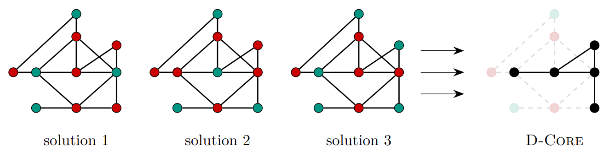

# CHILS &mdash; Concurrent Hybrid Iterated Local Search



## Ernestine Großmann, Kenneth Langedal, and Christian Schulz

Compile the project by running
```
make
```
This will produce an executable called CHILS.

There are no dependencies besides an OpenMP-compatible compiler. Adjust the CC variable in the Makefile if you prefer another compiler than GCC.

## Program Options

Note that the **-p N** option is necessary to run CHILS (**N** concurrent solutions). Otherwise, the program defaults to baseline local search.

| Option | Description | Default | Mandatory
|-|-|-|-
| **-h** | Display help information | | 
| **-v** | Verbose mode, shows continuous updates to STDOUT | |
| **-b** | Blocked mode, output additional results after 10%, 50%, and 100% of the  max time/iterations | |
| **-g path** | Path to the input graph, see input forma | | &check;
| **-i path** | Path to the initial solution, see output format | |
| **-o path** | Path to store the best solution found, see output format | Not stored |
| **-p N** | Run CHILS with **N** concurrent solutions | 1 (only LS) |
| **-t sec** | Timeout in seconds | 3600 (1h) |
| **-s sec** | Alternating interval for CHILS in seconds | 10 |
| **-q N** | Max queue size **N** after perturbe | 32 |
| **-c T** | Set number of threads to **T** | OMP_NUM_THREADS |
| **-r s** | Set random seed to **s** | time(NULL) |
| **-n it** | Max CHILS iterations | inf |
| **-m it** | Max local search iterations | inf |

The output of the program without the **-v** option is a single line on the format
```
instance_name,#vertices,#edges,WIS,time
```
For example, after running
```
./CHILS -g CR-T-D-4.graph
```
The output could look something like this
```
CR-T-D-4,651861,220480534,4922752,3557.2678
```
Where 4922752 is the solution size after 1 hour. 3557.2678 is the time when the best solution was found.

## How to Use

Examples of typical use cases are listed below. Naturally, change **-t** (time limit), **-q** (max queue size), and **-s** (alternating CHILS interval) as necessary.

### Baseline Local Search

```
./CHILS -g [path]
```

### Sequential CHILS

```
./CHILS -g [path] -p N -c 1
```

### Parallel CHILS

For best parallel performance, use
```
export OMP_NUM_THREADS=N
export OMP_PLACES=cores
export OMP_PROC_BIND=spread
```

And then run

```
./CHILS -g [path] -p N
```

## Input Format

CHILS expects graphs on the METIS graph format. A graph with **N** vertices is stored using **N + 1** lines. The first line lists the number of vertices, the number of edges, and the weight type. For CHILS, the first line should use 10 as the weight type to indicate vertex weights. Each subsequent line first gives the weight and then lists the neighbors of that node in **sorted** order.

Here is an example of a graph with 3 vertices of weight 15, 15, and 20, where the weight 20 vertex is connected to the two 15-weight vertices.

```
3 2 10
15 3
15 3
20 1 2
```

Notice that vertices are 1-indexed, and edges appear in the neighborhoods of both endpoints.

## Output Format

The output format, also used as input format for the **-i** option, is simply a list of 1-indexed vertices, one vertex per line. For example, the solution to the graph used above would look like this

```
1
2
```

## Reproducing Results from the Paper

Using the **-b** option gives additional information about solution size after 10%, 50%, and 100% of the time/iterations. The single output line then looks like
```
instance_name,#vertices,#edges,WIS_after_10%,WIS_after_50%,WIS_after_100%,time
```
For example, after running
```
./CHILS -g CR-T-D-4.graph -b
```
The output could look something like this
```
CR-T-D-4,651861,220480534,4900379,4919890,4922752,3557.2678
```
Where 4900379 is the solution size after 10 minutes, 4919890 after 30, and 4922752 after 1 hour. 3557.2678 is the time when the best solution was found.

### Parallel Experiments

The options **-n** and **-m** are used to set an exact number of CHILS/local search iterations. Together with **-r** to set a specific random seed, the execution can be made deterministic for parallel scalability experiments.